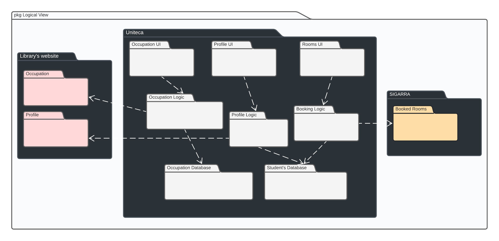
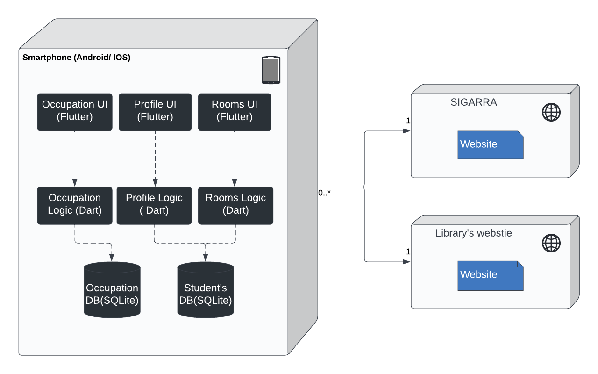

# 2LEIC07T1
## Uniteca

**Uniteca** is a mobile application designed to help students determine where to study.

### Table of contents

 - [Product Vision](vision.md)
 - [Requirements](requirements.md)
 - [Domain Model](domainmodel.md)
 - [Architecture and Design](ArchitectureAndDesign.md)

## Architecture and Design

This file incorporates a short description of the app's architecture.
The main component of our program is the mobile application. It is hosted on the user's phone and connects to the website. Data about the events is stored locally. The app is organized according to the **Model-View-Controller** pattern. 

### Logical architecture

Uniteca is the main component of the application. It contains all the **MVC** components:
 - The **View** (Occupation UI, Profile UI and Rooms UI) uses the data from the model and controller to display it to the user, through the Flutter interface. It also communicates to the Controller any action the user performs.
 - The **Controller** (Occupation Logic, Profile Logic and Booking Logic) is responsible for fetching the data from the website and saving it to the database. It is also the brain of the program since the information from View is processed here.
 - The **Model** (Occupation database, Student's database) holds and organizes all the program's data, including booked rooms, profile information and occupation values.

### Physical architecture

The physical architecture of the application is composed by:
 - Smarthphone (both in Android and IOS)
 - Sigarra's website 
 - Library's website

The chosen mobile framework to develop the UI was Flutter. For the logical section and database management we are using Dart and SqlLite respectively.

## Vertical prototype

Before any proper work was done, we started by forking the Uni repository and getting familiarized with the codebase. To do that we developed a simple page on the app that would display our names. 

   

This implementation can be found [here](https://github.com/LEIC-ES-2021-22/2LEIC07T1/tree/vertical-prototype).

