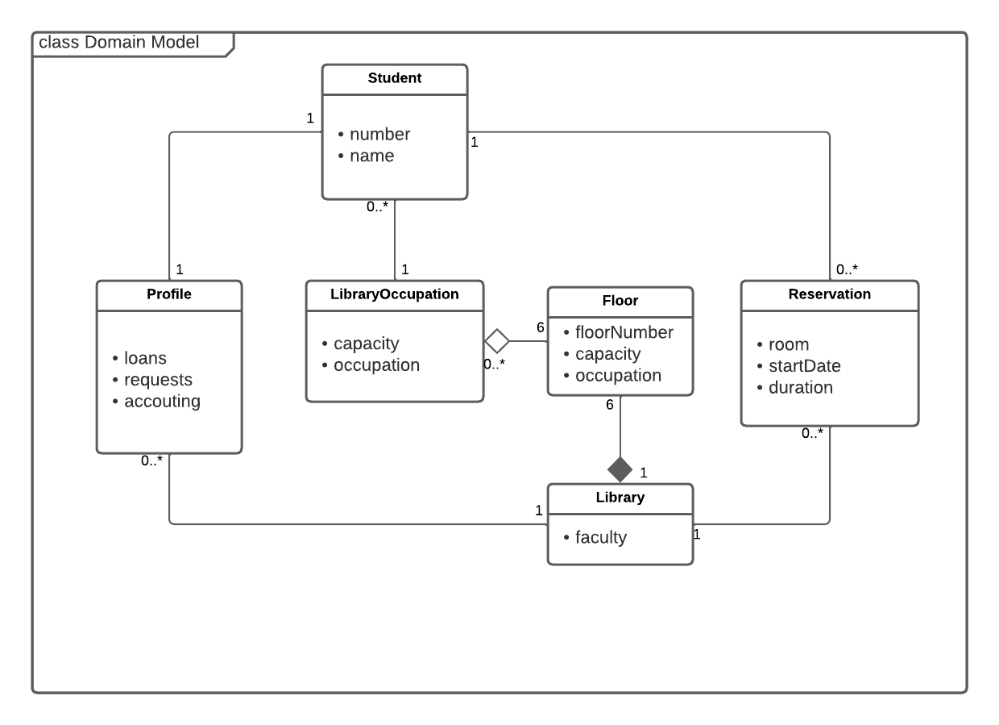

# 2LEIC07T1
## Uniteca

**Uniteca** is a mobile application designed to help students determine where to study.

### Table of contents

 - [Product Vision](vision.md)
 - [Requirements](requirements.md)
 - [Domain Model](domainmodel.md)
 - [Architecture and Design](ArchitectureAndDesign.md)

## Domain model

<table>
  <tr>
    <td>Student</td>
    <td>Represents the student even if is authenticated or not</td>
  </tr>
  <tr>
    <td>Authenticated Student</td>
    <td> The student with more privileges </td>
  </tr>
  <tr>
    <td>Room</td>
    <td> Represents the rooms that can be booked</td>
  </tr>
  <tr>
    <td>Ocupation</td>
    <td>
      The number of students in the library
    </td>
  </tr>
  <tr>
    <td>Library Profile</td>
    <td>
       Informations about requests of students
    </td>
  </tr>
  <tr>
    <td>Booking</td>
    <td>
     Represents the requests to book a room
    </td>
  </tr>
</table>

