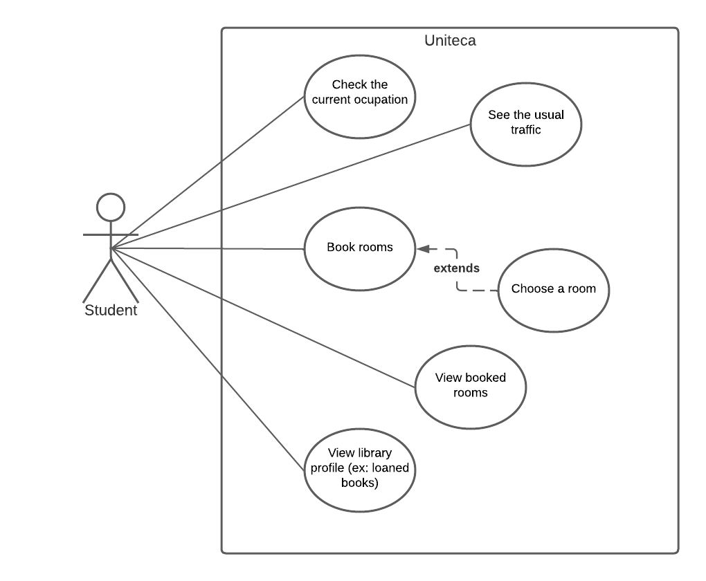

# Requirements 

## Use cases

### Use-case diagram

### Check the current occupation

<table>
  <tr>
    <td>Name</td>
    <td>Check the current occupation</td>
  </tr>
  <tr>
    <td>Actor</td>
    <td>Student</td>
  </tr>
  <tr>
    <td>Description</td>
    <td>Students can look up the current ocupation in the library.</td>
  </tr>
  <tr>
    <td>Preconditions</td>
    <td>
      <ul>
        <li>The occupation is availabe at the library's website.</li>
        <li>The library is open.</li>
      </ul>
    </td>
  </tr>
  <tr>
    <td>Postconditions</td>
    <td>
      <ul>
        <li>The student is informed of the current occupation.</li>
      </ul>
    </td>
  </tr>
  <tr>
    <td>Normal flow</td>
    <td>
      <ol>
        <li>The student accesses the occupation.</li>
        <li>The system fetches the occupation from the website.</li>
        <li>The occupation is presented in a user friendly way.</li>
      </ol>
    </td>
  </tr>
  <tr>
    <td>Alternative flows and exceptions</td>
    <td>If the library is closed, a warning is issued.</td>
  </tr>
</table>

### See the usual traffic

<table>
  <tr>
    <td>Name</td>
    <td>See the usual traffic</td>
  </tr>
  <tr>
    <td>Actor</td>
    <td>Student</td>
  </tr>
  <tr>
    <td>Description</td>
    <td>Students can compare the current occupation to the usual traffic of the library.</td>
  </tr>
  <tr>
    <td>Preconditions</td>
    <td>
      <ul>
        <li>Data has already been collected.</li>
      </ul>
    </td>
  </tr>
  <tr>
    <td>Postconditions</td>
    <td>
      <ul>
        <li>The student is informed of the library's usual traffic.</li>
      </ul>
    </td>
  </tr>
  <tr>
    <td>Normal flow</td>
    <td>
      <ol>
        <li>The student looks for the usual traffic.</li>
        <li>The system gets the usual occupation from the collected data.</li>
        <li>The traffic is presented in a user friendly way.</li>
      </ol>
    </td>
  </tr>
  <tr>
    <td>Alternative flows and exceptions</td>
    <td>If the system is not aware of the library's traffic it won't be displayed.</td>
  </tr>
</table>

### Book 6th floor rooms

<table>
  <tr>
    <td>Name</td>
    <td>Book 6th floor rooms</td>
  </tr>
  <tr>
    <td>Actor</td>
    <td>Student</td>
  </tr>
  <tr>
    <td>Description</td>
    <td>Students can book a room for a selected date and time.</td>
  </tr>
  <tr>
    <td>Preconditions</td>
    <td>
      <ul>
        <li>There are enough available rooms.</li>
      </ul>
    </td>
  </tr>
  <tr>
    <td>Postconditions</td>
    <td>
      <ul>
        <li>The room has been booked on the library's system.</li>
        <li>The room is no longer available for reservation.</li>
      </ul>
    </td>
  </tr>
  <tr>
    <td>Normal flow</td>
    <td>
      <ol>
        <li>The student starts the booking process.</li>
        <li>The system asks for the date and time, duration.</li>
        <li>If wanted, the customer can disable automatic room allocation.</li>
        <li>The system asks the user for comments on the reservation.</li>
        <li>The system communicates the reservation to the website.</li>
        <li>The system displays the status of the reservation.</li>
      </ol>
    </td>
  </tr>
  <tr>
    <td>Alternative flows and exceptions</td>
    <td>
      <ul>
        <li>If the user decides to chose a room (step 3) the system asks which room to be booked.</li>
      </ul>
    </td>
  </tr>
</table>

### View Library Profile  

<table>
  <tr>
    <td>Name</td>
    <td>View Library Profile</td>
  </tr>
  <tr>
    <td>Actor</td>
    <td>Student</td>
  </tr>
  <tr>
    <td>Description</td>
    <td>Students can view their library profile.</td>
  </tr>
  <tr>
    <td>Preconditions</td>
    <td>
      <ul>
        <li>The student is authenticated.</li>
      </ul>
    </td>
  </tr>
  <tr>
    <td>Postconditions</td>
    <td>
      <ul>
        <li>The student gets information of his/hers own library profile.</li>
      </ul>
    </td>
  </tr>
  <tr>
    <td>Normal flow</td>
    <td>
      <ol>
        <li>The student accesses librarys's profile.</li>
        <li>The information (ex: total number of loaned books, loan requests, loan history etc.) is displayed in a user friendly way.</li>
      </ol>
    </td>
  </tr>
  <tr>
    <td>Alternative flows and exceptions</td>
    <td>
      <ul>
        <li>In step 1 the student needs to be authenticated, otherwise it's not possible to get access to the profile.</li>
      </ul>
    </td>
  </tr>
</table>

